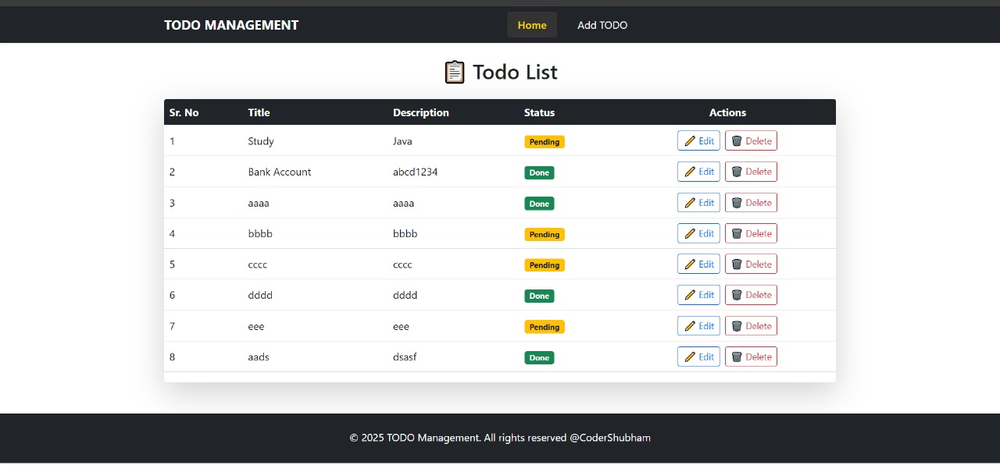
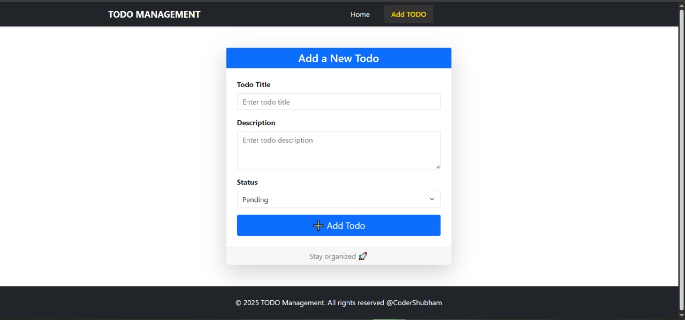
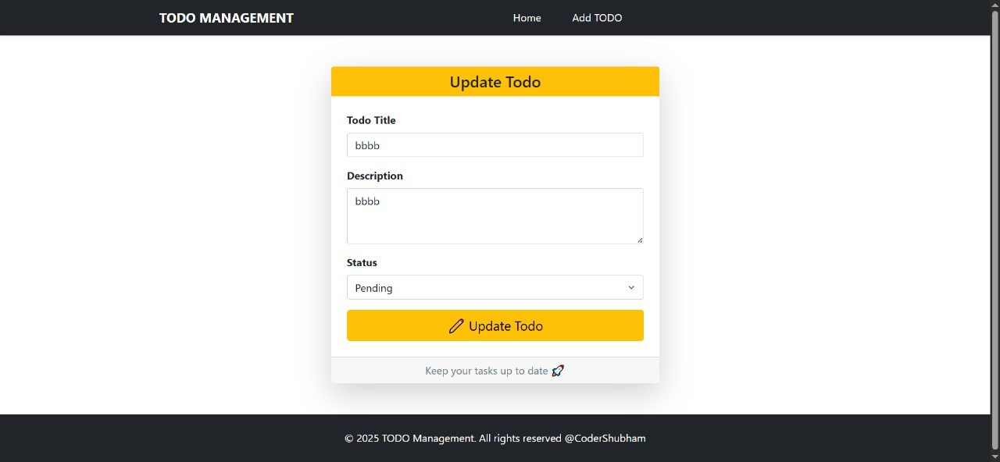

# 📝 Todo Management App

A full-stack **Todo Management application** built with **React.js** for the frontend and **Spring Boot** for the backend. This app allows users to **add, update, and manage tasks** efficiently with a clean, modern interface.

---

## 📌 Features

- Add new tasks with title, description, and status.  
- Update existing tasks.  
- Mark tasks as **Pending** or **Done**.  
- Fully responsive UI with **Bootstrap 5**.  
- SweetAlert2 notifications for better UX.  
- Backend powered by **Spring Boot REST API** for persistent data.

---

## 🖼 Screenshots

### Home Page


### Add Todo


### Update Todo


---

## 🛠 Tech Stack

| Frontend       | Backend       | Database       |
|----------------|---------------|----------------|
| React.js       | Spring Boot   | H2 / MySQL     |
| Bootstrap 5    | REST API      | JPA/Hibernate  |
| SweetAlert2    | Java          |                |

---

## 🚀 Installation & Running

### Frontend (React.js)
Open terminal in the frontend folder and run:
```bash
cd frontend
npm install
npm start
```

### Backend (Spring Boot)
Open terminal in the backend folder and run:

```bash
cd backend
mvn clean install
mvn spring-boot:run


